# King County Housing Data Project

## Outline
-[Library & Data Import](#Library-&-Data-Import) <br>
-[Function Creation](#Function-Creation) <br>
-[Data Investigation](#Data-Investigation) <br>
-[Data Scrub](#Data-Scrub) <br>
-[Data Exploration](#Data-Exploration) <br>
-[Further Examining Variable Features](#Further-Examining-Variable-Features) <br>
-[Model Creation & Experimentation](#Model-Creation-&-Experimentation) <br>
-[Validation](#Validation) <br>
-[Results & Summary](#Results-&-Summary) <br>

## Library & Data Import


```python
import warnings; warnings.simplefilter('ignore')

import pandas as pd
import numpy as np

import statsmodels.api as sm
import statsmodels.stats.api as sms
import statsmodels.formula.api as smf

import matplotlib.pyplot as plt
import seaborn as sns
plt.style.use('ggplot')

import scipy.stats as stats

from sklearn.model_selection import train_test_split, cross_val_score
from sklearn.linear_model import LinearRegression
```


```python
df = pd.read_csv('kc_house_data.csv')
```

## Function Creation


```python
# Creating a Heatmap that can be easily altered to look at different correlations.
def make_heatmap(df = df, columns = None, figsize = (20, 20)):
    if columns is None:
        corr = df.corr()
    else:
        corr = df[columns].corr()
    plt.figure(figsize = figsize)
    sns.heatmap(np.abs(corr), cmap = sns.color_palette('Blues'), annot = True, fmt = '0.2g')
    plt.show()
```


```python
# Creating an OLS Model that can be easily altered to look at the results.
def make_ols_model(df = df, target = 'price', columns_to_use = None, add_constant = True):
    X = df[columns_to_use]
    y = df[target]
    if add_constant:
        X = sm.add_constant(X)
    ols = sm.OLS(y, X)
    results = ols.fit()
    print(results.summary())
    return ols, results
```


```python
# Creating Histograms to help view data normalization.
def make_histogram(df = df, column = 'price', bins = 20):
    plt.figure(figsize = (8, 5))
    plt.hist(df[column], bins = bins)
    plt.title(column)
    plt.show()
```


```python
# Creating Linear Regression graphs that can look at single or multiple columns, and lay them out nicely if multiple.
def make_reg_graph(df = df, columns = None, target = 'price', figsize = (8,8)):
    y = df[target].values.reshape(-1, 1)
    linreg = LinearRegression()
    if type(columns) != str:
        snum = np.sqrt(len(columns))+1
        plt.figure(figsize = figsize)
        for i, col in enumerate(columns):
            ax = plt.subplot(snum, snum, i+1)
            X = df[col].values.reshape(-1, 1)
            linreg.fit(X, y)
            y_pred = linreg.predict(X)
            ax.scatter(X, y, color = 'blue')
            ax.plot(X, y_pred, color = 'red')
            plt.xlabel(col.title().replace('_', ' '))
            plt.ylabel('Price')
        plt.tight_layout()
    else:
        X = df[columns].values.reshape(-1, 1)
        linreg.fit(X, y)
        y_pred = linreg.predict(X)
        plt.scatter(X, y, color = 'blue')
        plt.plot(X, y_pred, color = 'red')
        plt.xlabel(columns.title().replace('_', ' '))
        plt.ylabel('Price')
```


```python
# Plotting residuals to see outliers and homoskedacity.
def make_residual_plots(residuals):
    x = np.linspace(0, 1, residuals.shape[0])
    plt.figure(figsize=(8, 5))
    plt.scatter(x, residuals, alpha=0.7, c='purple')
    plt.title("Residuals")
    plt.hlines(y=0, colors='r', xmin=0, xmax=1, linewidth=3)
    plt.show()    
    plt.figure(figsize=(8, 5))
    plt.hist(residuals, bins=20, color='purple')
    plt.title("Residuals Histogram")
    plt.show()
```

## Data Investigation


```python
df.head()
```


<div>
<style scoped>
    .dataframe tbody tr th:only-of-type {
        vertical-align: middle;
    }

    .dataframe tbody tr th {
        vertical-align: top;
    }

    .dataframe thead th {
        text-align: right;
    }
</style>
<table border="1" class="dataframe">
  <thead>
    <tr style="text-align: right;">
      <th></th>
      <th>id</th>
      <th>date</th>
      <th>price</th>
      <th>bedrooms</th>
      <th>bathrooms</th>
      <th>sqft_living</th>
      <th>sqft_lot</th>
      <th>floors</th>
      <th>waterfront</th>
      <th>view</th>
      <th>...</th>
      <th>grade</th>
      <th>sqft_above</th>
      <th>sqft_basement</th>
      <th>yr_built</th>
      <th>yr_renovated</th>
      <th>zipcode</th>
      <th>lat</th>
      <th>long</th>
      <th>sqft_living15</th>
      <th>sqft_lot15</th>
    </tr>
  </thead>
  <tbody>
    <tr>
      <th>0</th>
      <td>7129300520</td>
      <td>10/13/2014</td>
      <td>221900.0</td>
      <td>3</td>
      <td>1.00</td>
      <td>1180</td>
      <td>5650</td>
      <td>1.0</td>
      <td>NaN</td>
      <td>0.0</td>
      <td>...</td>
      <td>7</td>
      <td>1180</td>
      <td>0.0</td>
      <td>1955</td>
      <td>0.0</td>
      <td>98178</td>
      <td>47.5112</td>
      <td>-122.257</td>
      <td>1340</td>
      <td>5650</td>
    </tr>
    <tr>
      <th>1</th>
      <td>6414100192</td>
      <td>12/9/2014</td>
      <td>538000.0</td>
      <td>3</td>
      <td>2.25</td>
      <td>2570</td>
      <td>7242</td>
      <td>2.0</td>
      <td>0.0</td>
      <td>0.0</td>
      <td>...</td>
      <td>7</td>
      <td>2170</td>
      <td>400.0</td>
      <td>1951</td>
      <td>1991.0</td>
      <td>98125</td>
      <td>47.7210</td>
      <td>-122.319</td>
      <td>1690</td>
      <td>7639</td>
    </tr>
    <tr>
      <th>2</th>
      <td>5631500400</td>
      <td>2/25/2015</td>
      <td>180000.0</td>
      <td>2</td>
      <td>1.00</td>
      <td>770</td>
      <td>10000</td>
      <td>1.0</td>
      <td>0.0</td>
      <td>0.0</td>
      <td>...</td>
      <td>6</td>
      <td>770</td>
      <td>0.0</td>
      <td>1933</td>
      <td>NaN</td>
      <td>98028</td>
      <td>47.7379</td>
      <td>-122.233</td>
      <td>2720</td>
      <td>8062</td>
    </tr>
    <tr>
      <th>3</th>
      <td>2487200875</td>
      <td>12/9/2014</td>
      <td>604000.0</td>
      <td>4</td>
      <td>3.00</td>
      <td>1960</td>
      <td>5000</td>
      <td>1.0</td>
      <td>0.0</td>
      <td>0.0</td>
      <td>...</td>
      <td>7</td>
      <td>1050</td>
      <td>910.0</td>
      <td>1965</td>
      <td>0.0</td>
      <td>98136</td>
      <td>47.5208</td>
      <td>-122.393</td>
      <td>1360</td>
      <td>5000</td>
    </tr>
    <tr>
      <th>4</th>
      <td>1954400510</td>
      <td>2/18/2015</td>
      <td>510000.0</td>
      <td>3</td>
      <td>2.00</td>
      <td>1680</td>
      <td>8080</td>
      <td>1.0</td>
      <td>0.0</td>
      <td>0.0</td>
      <td>...</td>
      <td>8</td>
      <td>1680</td>
      <td>0.0</td>
      <td>1987</td>
      <td>0.0</td>
      <td>98074</td>
      <td>47.6168</td>
      <td>-122.045</td>
      <td>1800</td>
      <td>7503</td>
    </tr>
  </tbody>
</table>
<p>5 rows × 21 columns</p>
</div>


```python
df.info()
df.isna().sum()
```

    <class 'pandas.core.frame.DataFrame'>
    RangeIndex: 21597 entries, 0 to 21596
    Data columns (total 21 columns):
    id               21597 non-null int64
    date             21597 non-null object
    price            21597 non-null float64
    bedrooms         21597 non-null int64
    bathrooms        21597 non-null float64
    sqft_living      21597 non-null int64
    sqft_lot         21597 non-null int64
    floors           21597 non-null float64
    waterfront       19221 non-null float64
    view             21534 non-null float64
    condition        21597 non-null int64
    grade            21597 non-null int64
    sqft_above       21597 non-null int64
    sqft_basement    21597 non-null object
    yr_built         21597 non-null int64
    yr_renovated     17755 non-null float64
    zipcode          21597 non-null int64
    lat              21597 non-null float64
    long             21597 non-null float64
    sqft_living15    21597 non-null int64
    sqft_lot15       21597 non-null int64
    dtypes: float64(8), int64(11), object(2)
    memory usage: 3.5+ MB
    


    id                  0
    date                0
    price               0
    bedrooms            0
    bathrooms           0
    sqft_living         0
    sqft_lot            0
    floors              0
    waterfront       2376
    view               63
    condition           0
    grade               0
    sqft_above          0
    sqft_basement       0
    yr_built            0
    yr_renovated     3842
    zipcode             0
    lat                 0
    long                0
    sqft_living15       0
    sqft_lot15          0
    dtype: int64


```python
df.describe()
```


<div>
<style scoped>
    .dataframe tbody tr th:only-of-type {
        vertical-align: middle;
    }

    .dataframe tbody tr th {
        vertical-align: top;
    }

    .dataframe thead th {
        text-align: right;
    }
</style>
<table border="1" class="dataframe">
  <thead>
    <tr style="text-align: right;">
      <th></th>
      <th>id</th>
      <th>price</th>
      <th>bedrooms</th>
      <th>bathrooms</th>
      <th>sqft_living</th>
      <th>sqft_lot</th>
      <th>floors</th>
      <th>waterfront</th>
      <th>view</th>
      <th>condition</th>
      <th>grade</th>
      <th>sqft_above</th>
      <th>yr_built</th>
      <th>yr_renovated</th>
      <th>zipcode</th>
      <th>lat</th>
      <th>long</th>
      <th>sqft_living15</th>
      <th>sqft_lot15</th>
    </tr>
  </thead>
  <tbody>
    <tr>
      <th>count</th>
      <td>2.159700e+04</td>
      <td>2.159700e+04</td>
      <td>21597.000000</td>
      <td>21597.000000</td>
      <td>21597.000000</td>
      <td>2.159700e+04</td>
      <td>21597.000000</td>
      <td>19221.000000</td>
      <td>21534.000000</td>
      <td>21597.000000</td>
      <td>21597.000000</td>
      <td>21597.000000</td>
      <td>21597.000000</td>
      <td>17755.000000</td>
      <td>21597.000000</td>
      <td>21597.000000</td>
      <td>21597.000000</td>
      <td>21597.000000</td>
      <td>21597.000000</td>
    </tr>
    <tr>
      <th>mean</th>
      <td>4.580474e+09</td>
      <td>5.402966e+05</td>
      <td>3.373200</td>
      <td>2.115826</td>
      <td>2080.321850</td>
      <td>1.509941e+04</td>
      <td>1.494096</td>
      <td>0.007596</td>
      <td>0.233863</td>
      <td>3.409825</td>
      <td>7.657915</td>
      <td>1788.596842</td>
      <td>1970.999676</td>
      <td>83.636778</td>
      <td>98077.951845</td>
      <td>47.560093</td>
      <td>-122.213982</td>
      <td>1986.620318</td>
      <td>12758.283512</td>
    </tr>
    <tr>
      <th>std</th>
      <td>2.876736e+09</td>
      <td>3.673681e+05</td>
      <td>0.926299</td>
      <td>0.768984</td>
      <td>918.106125</td>
      <td>4.141264e+04</td>
      <td>0.539683</td>
      <td>0.086825</td>
      <td>0.765686</td>
      <td>0.650546</td>
      <td>1.173200</td>
      <td>827.759761</td>
      <td>29.375234</td>
      <td>399.946414</td>
      <td>53.513072</td>
      <td>0.138552</td>
      <td>0.140724</td>
      <td>685.230472</td>
      <td>27274.441950</td>
    </tr>
    <tr>
      <th>min</th>
      <td>1.000102e+06</td>
      <td>7.800000e+04</td>
      <td>1.000000</td>
      <td>0.500000</td>
      <td>370.000000</td>
      <td>5.200000e+02</td>
      <td>1.000000</td>
      <td>0.000000</td>
      <td>0.000000</td>
      <td>1.000000</td>
      <td>3.000000</td>
      <td>370.000000</td>
      <td>1900.000000</td>
      <td>0.000000</td>
      <td>98001.000000</td>
      <td>47.155900</td>
      <td>-122.519000</td>
      <td>399.000000</td>
      <td>651.000000</td>
    </tr>
    <tr>
      <th>25%</th>
      <td>2.123049e+09</td>
      <td>3.220000e+05</td>
      <td>3.000000</td>
      <td>1.750000</td>
      <td>1430.000000</td>
      <td>5.040000e+03</td>
      <td>1.000000</td>
      <td>0.000000</td>
      <td>0.000000</td>
      <td>3.000000</td>
      <td>7.000000</td>
      <td>1190.000000</td>
      <td>1951.000000</td>
      <td>0.000000</td>
      <td>98033.000000</td>
      <td>47.471100</td>
      <td>-122.328000</td>
      <td>1490.000000</td>
      <td>5100.000000</td>
    </tr>
    <tr>
      <th>50%</th>
      <td>3.904930e+09</td>
      <td>4.500000e+05</td>
      <td>3.000000</td>
      <td>2.250000</td>
      <td>1910.000000</td>
      <td>7.618000e+03</td>
      <td>1.500000</td>
      <td>0.000000</td>
      <td>0.000000</td>
      <td>3.000000</td>
      <td>7.000000</td>
      <td>1560.000000</td>
      <td>1975.000000</td>
      <td>0.000000</td>
      <td>98065.000000</td>
      <td>47.571800</td>
      <td>-122.231000</td>
      <td>1840.000000</td>
      <td>7620.000000</td>
    </tr>
    <tr>
      <th>75%</th>
      <td>7.308900e+09</td>
      <td>6.450000e+05</td>
      <td>4.000000</td>
      <td>2.500000</td>
      <td>2550.000000</td>
      <td>1.068500e+04</td>
      <td>2.000000</td>
      <td>0.000000</td>
      <td>0.000000</td>
      <td>4.000000</td>
      <td>8.000000</td>
      <td>2210.000000</td>
      <td>1997.000000</td>
      <td>0.000000</td>
      <td>98118.000000</td>
      <td>47.678000</td>
      <td>-122.125000</td>
      <td>2360.000000</td>
      <td>10083.000000</td>
    </tr>
    <tr>
      <th>max</th>
      <td>9.900000e+09</td>
      <td>7.700000e+06</td>
      <td>33.000000</td>
      <td>8.000000</td>
      <td>13540.000000</td>
      <td>1.651359e+06</td>
      <td>3.500000</td>
      <td>1.000000</td>
      <td>4.000000</td>
      <td>5.000000</td>
      <td>13.000000</td>
      <td>9410.000000</td>
      <td>2015.000000</td>
      <td>2015.000000</td>
      <td>98199.000000</td>
      <td>47.777600</td>
      <td>-121.315000</td>
      <td>6210.000000</td>
      <td>871200.000000</td>
    </tr>
  </tbody>
</table>
</div>


```python
df.waterfront.value_counts()
df.view.value_counts()
df.yr_renovated.value_counts()
```


    0.0       17011
    2014.0       73
    2003.0       31
    2013.0       31
    2007.0       30
    2000.0       29
    2005.0       29
    1990.0       22
    2004.0       22
    2009.0       21
    1989.0       20
    2006.0       20
    2002.0       17
    1991.0       16
    1998.0       16
    1984.0       16
    1999.0       15
    2008.0       15
    2010.0       15
    2001.0       15
    1983.0       15
    2015.0       14
    1985.0       14
    1986.0       14
    1987.0       14
    1994.0       14
    1992.0       13
    1993.0       12
    1997.0       12
    1995.0       12
              ...  
    1975.0        5
    1964.0        5
    1969.0        4
    1963.0        4
    1973.0        4
    1981.0        4
    1965.0        4
    1978.0        3
    1960.0        3
    1958.0        3
    1956.0        3
    1955.0        3
    1945.0        3
    1972.0        3
    1967.0        2
    1957.0        2
    1940.0        2
    1974.0        2
    1962.0        2
    1953.0        1
    1950.0        1
    1934.0        1
    1944.0        1
    1976.0        1
    1948.0        1
    1946.0        1
    1959.0        1
    1971.0        1
    1951.0        1
    1954.0        1
    Name: yr_renovated, Length: 70, dtype: int64


## Data Scrub


```python
df = df.drop('id', axis = 1) # Removing unnecessary ID Column, no effect on Price.
```


```python
# All NaN values are in columns that have a zero value where there either is no data or a categorical
# false value, so replacing all NaN values across the board with a zero value is valid.
df.fillna(value = 0, inplace = True)
df.isna().sum()
```


    date             0
    price            0
    bedrooms         0
    bathrooms        0
    sqft_living      0
    sqft_lot         0
    floors           0
    waterfront       0
    view             0
    condition        0
    grade            0
    sqft_above       0
    sqft_basement    0
    yr_built         0
    yr_renovated     0
    zipcode          0
    lat              0
    long             0
    sqft_living15    0
    sqft_lot15       0
    dtype: int64


```python
#Investigating columns with type Object for null or dummy values
df.sqft_basement.value_counts()
df.loc[df['sqft_basement'] != '?', 'sqft_basement'].astype(float).mean()
df.loc[df['sqft_basement'] != '?', 'sqft_basement'].astype(float).median()
# Median Value is 0, as expected based on the value count. Assumption that ? value is an unknown, while
# 0 values are houses known to have no basement. Choosing to change ? to 0 values due to relatively low 
# number (454), and convert whole column to float to be easier to work with.
df['sqft_basement'].replace(to_replace = '?', value = 0, inplace = True)
df['sqft_basement'] = df['sqft_basement'].astype(float)
```


```python
# Converting Date column to datetime type.
df['date'] = pd.to_datetime(df['date'], format = '%m/%d/%Y')
```


```python
# Binning Date column into seasons to look at sale prices per season.
df['season'] = (df['date'].dt.month)//3
df['season'].replace(to_replace = 4, value = 0, inplace = True)
df['season'].value_counts()
```


    1    6518
    2    6328
    3    5056
    0    3695
    Name: season, dtype: int64


## Data Exploration


```python
make_heatmap(df = df, columns = df.columns)
```


```python
# Dividing columns into what can be somewhat easily changed during a renovation vs what is
# static about the house. Price is included in both lists as the target value for comparison.
# Sqft_above and sqft_basement are left out due to being included in sqft_living.
variable_features = ['price', 'bedrooms', 'bathrooms', 'sqft_living', 'floors', 
                     'condition', 'grade', 'yr_renovated', 'season']
non_variable_features = ['price', 'sqft_lot', 'waterfront', 'view', 'yr_built', 
                         'zipcode', 'lat', 'long', 'sqft_living15', 'sqft_lot15']

make_heatmap(df = df, columns = variable_features)
make_heatmap(df = df, columns = non_variable_features)
```


```python
# Creating visuals of each non-variable feature vs price to eventually compare to the variable features.
non_variable_features = ['sqft_lot', 'waterfront', 'view', 'yr_built', 
                         'zipcode', 'lat', 'long', 'sqft_living15', 'sqft_lot15']
fig = plt.figure(figsize = (12,12))
for i, col in enumerate(non_variable_features):
    ax = fig.add_subplot(3, 3, i+1)
    plt.scatter(df[col], df['price'])
    plt.ylabel('Price')
    plt.xlabel(col)
    plt.xticks(rotation = 45)
    plt.title('Price vs {}'.format(col.title().replace('_', ' ')))
    plt.tight_layout()
```


```python
# Creating visuals of each variable feature vs price to compare to the non-variable features.
variable_features = ['bedrooms', 'bathrooms', 'sqft_living', 'floors', 
                     'condition', 'grade', 'yr_renovated', 'season']
fig = plt.figure(figsize = (12,6))
for i, col in enumerate(variable_features):
    ax = fig.add_subplot(2, 4, i+1)
    plt.scatter(df[col], df['price'])
    plt.ylabel('Price')
    plt.xlabel(col)
    plt.xticks(rotation = 45)
    plt.title('Price vs {}'.format(col.title().replace('_', ' ')))
    plt.tight_layout()
```


## Further Examining Variable Features


```python
df['total_rooms'] = df['bathrooms'] + df['bedrooms']
plt.scatter(df['total_rooms'], df['price'])
```


    <matplotlib.collections.PathCollection at 0x1ebc1bd7c50>


```python
variable_features = ['price', 'sqft_living', 'floors', 'condition', 
                     'grade', 'yr_renovated', 'season', 'total_rooms']
make_heatmap(df = df, columns = variable_features)
```


```python
# Average Price at each Condition tier excluding outliers.
sns.boxplot(df['condition'], df['price'], showfliers = False)
```


    <matplotlib.axes._subplots.AxesSubplot at 0x1ebc46bd0f0>


```python
# Average Price at each Grade tier excluding outliers.
sns.boxplot(df['grade'], df['price'], showfliers = False)
```


    <matplotlib.axes._subplots.AxesSubplot at 0x1ebc1a70f98>


```python
# Average Price for each Season excluding outliers.
sns.boxplot(df['season'], df['price'], showfliers = False)
```


    <matplotlib.axes._subplots.AxesSubplot at 0x1ebc1c4c320>


```python
# Average Price for each Floor amount excluding outliers.
sns.boxplot(df['floors'], df['price'], showfliers = False)
```


    <matplotlib.axes._subplots.AxesSubplot at 0x1ebc1bf0cc0>


```python
variable_features = ['sqft_living', 'floors', 'condition', 
                     'grade', 'yr_renovated', 'season', 'total_rooms']
make_reg_graph(df, columns = variable_features, figsize = (15, 10))
```


## Model Creation & Experimentation


```python
# Experiment #1
variable_features = ['sqft_living', 'floors', 'condition', 
                     'grade', 'yr_renovated', 'season', 'total_rooms']
ols, res = make_ols_model(df, columns_to_use = variable_features, add_constant = False)
```

                                OLS Regression Results                            
    ==============================================================================
    Dep. Variable:                  price   R-squared:                       0.850
    Model:                            OLS   Adj. R-squared:                  0.850
    Method:                 Least Squares   F-statistic:                 1.754e+04
    Date:                Fri, 27 Sep 2019   Prob (F-statistic):               0.00
    Time:                        12:02:51   Log-Likelihood:            -2.9931e+05
    No. Observations:               21597   AIC:                         5.986e+05
    Df Residuals:                   21590   BIC:                         5.987e+05
    Df Model:                           7                                         
    Covariance Type:            nonrobust                                         
    ================================================================================
                       coef    std err          t      P>|t|      [0.025      0.975]
    --------------------------------------------------------------------------------
    sqft_living    296.5592      3.130     94.740      0.000     290.424     302.695
    floors       -2.155e+04   3742.953     -5.757      0.000   -2.89e+04   -1.42e+04
    condition    -5510.8620   2188.233     -2.518      0.012   -9799.961   -1221.763
    grade         3.876e+04   1658.155     23.373      0.000    3.55e+04     4.2e+04
    yr_renovated    83.4364      4.732     17.632      0.000      74.161      92.712
    season       -1.186e+04   1666.168     -7.121      0.000   -1.51e+04   -8598.391
    total_rooms  -5.515e+04   1738.741    -31.717      0.000   -5.86e+04   -5.17e+04
    ==============================================================================
    Omnibus:                    15894.757   Durbin-Watson:                   1.988
    Prob(Omnibus):                  0.000   Jarque-Bera (JB):           698593.149
    Skew:                           3.081   Prob(JB):                         0.00
    Kurtosis:                      30.173   Cond. No.                     5.21e+03
    ==============================================================================
    
    Warnings:
    [1] Standard Errors assume that the covariance matrix of the errors is correctly specified.
    [2] The condition number is large, 5.21e+03. This might indicate that there are
    strong multicollinearity or other numerical problems.
    

### Experiment #1 Observations
With Constant: Decent R-Squared, very high Condition Number. <br>
Without Constant: Very good R-Squared, lower but still quite high Condition Number. <br>
Next Step: Remove Total Rooms to check for Multicolinearity with Sqft Living.


```python
# Experiment #2
variable_features = ['sqft_living', 'floors', 'condition', 
                     'grade', 'yr_renovated', 'season']
ols, res = make_ols_model(df, columns_to_use = variable_features, add_constant = False)
```

                                OLS Regression Results                            
    ==============================================================================
    Dep. Variable:                  price   R-squared:                       0.843
    Model:                            OLS   Adj. R-squared:                  0.843
    Method:                 Least Squares   F-statistic:                 1.939e+04
    Date:                Fri, 27 Sep 2019   Prob (F-statistic):               0.00
    Time:                        12:02:54   Log-Likelihood:            -2.9980e+05
    No. Observations:               21597   AIC:                         5.996e+05
    Df Residuals:                   21591   BIC:                         5.997e+05
    Df Model:                           6                                         
    Covariance Type:            nonrobust                                         
    ================================================================================
                       coef    std err          t      P>|t|      [0.025      0.975]
    --------------------------------------------------------------------------------
    sqft_living    240.7123      2.648     90.916      0.000     235.523     245.902
    floors       -4.722e+04   3738.460    -12.631      0.000   -5.45e+04   -3.99e+04
    condition    -2.426e+04   2155.326    -11.257      0.000   -2.85e+04      -2e+04
    grade         2.826e+04   1662.212     17.004      0.000     2.5e+04    3.15e+04
    yr_renovated    80.7212      4.840     16.677      0.000      71.234      90.208
    season       -1.327e+04   1703.901     -7.788      0.000   -1.66e+04   -9930.158
    ==============================================================================
    Omnibus:                    16322.311   Durbin-Watson:                   1.980
    Prob(Omnibus):                  0.000   Jarque-Bera (JB):           751591.602
    Skew:                           3.196   Prob(JB):                         0.00
    Kurtosis:                      31.184   Cond. No.                     5.08e+03
    ==============================================================================
    
    Warnings:
    [1] Standard Errors assume that the covariance matrix of the errors is correctly specified.
    [2] The condition number is large, 5.08e+03. This might indicate that there are
    strong multicollinearity or other numerical problems.
    

### Experiment #2 Observations
Very similar results, Condition has come down slightly, but so has R-Squared. <br>
Next Step: Try normalizing Sqft Living to see if that has an effect with and without Total Rooms.


```python
df['sqft_living_log'] = np.log(df['sqft_living'])
make_reg_graph(df, columns = 'sqft_living_log')
```


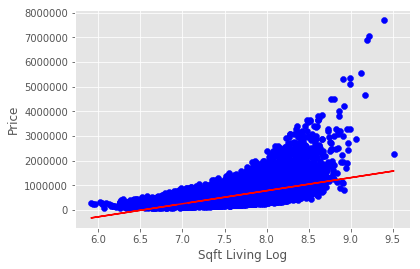


```python
# Experiment #3
variable_features = ['sqft_living_log', 'floors', 'condition', 
                     'grade', 'yr_renovated', 'season', 'total_rooms']
ols, res = make_ols_model(df, columns_to_use = variable_features, add_constant = False)
```

                                OLS Regression Results                            
    ==============================================================================
    Dep. Variable:                  price   R-squared:                       0.823
    Model:                            OLS   Adj. R-squared:                  0.823
    Method:                 Least Squares   F-statistic:                 1.437e+04
    Date:                Fri, 27 Sep 2019   Prob (F-statistic):               0.00
    Time:                        12:02:58   Log-Likelihood:            -3.0111e+05
    No. Observations:               21597   AIC:                         6.022e+05
    Df Residuals:                   21590   BIC:                         6.023e+05
    Df Model:                           7                                         
    Covariance Type:            nonrobust                                         
    ===================================================================================
                          coef    std err          t      P>|t|      [0.025      0.975]
    -----------------------------------------------------------------------------------
    sqft_living_log -1.979e+05   3024.500    -65.439      0.000   -2.04e+05   -1.92e+05
    floors          -4.664e+04   4045.196    -11.529      0.000   -5.46e+04   -3.87e+04
    condition        4.337e+04   2961.048     14.648      0.000    3.76e+04    4.92e+04
    grade            2.111e+05   2331.620     90.528      0.000    2.07e+05    2.16e+05
    yr_renovated      113.1834      5.152     21.970      0.000     103.086     123.281
    season          -7027.0405   1822.218     -3.856      0.000   -1.06e+04   -3455.359
    total_rooms      6.319e+04   1611.080     39.225      0.000       6e+04    6.64e+04
    ==============================================================================
    Omnibus:                    19220.727   Durbin-Watson:                   1.973
    Prob(Omnibus):                  0.000   Jarque-Bera (JB):          1675866.412
    Skew:                           3.912   Prob(JB):                         0.00
    Kurtosis:                      45.440   Cond. No.                         854.
    ==============================================================================
    
    Warnings:
    [1] Standard Errors assume that the covariance matrix of the errors is correctly specified.
    

### Experiment #3 Observations
Log Normalizing Sqft Living has resulted in much better Condition Number, and now adding Total Rooms back increases the R-Squared without affecting the Condition Number. Kurtosis is also better with Total Rooms than without, however, was highly affected by the normalization. <br>
Next Step: Check Histograms of features to look for Skew and Kurtosis, and find ones that may need to be removed.


```python
for col in variable_features:
    make_histogram(df, col)
```


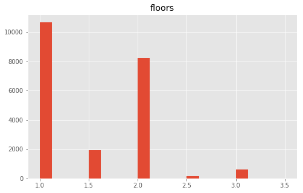


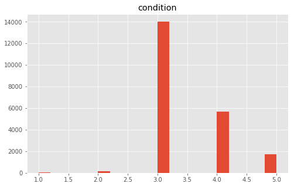


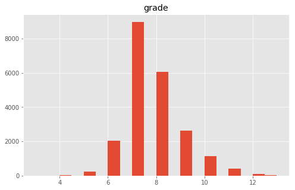


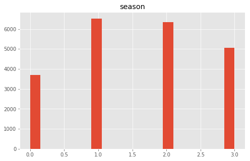


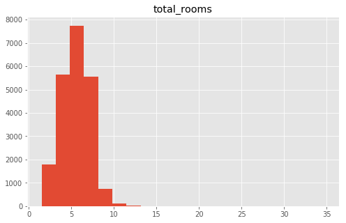


```python
# Removing single item that had more than 30 rooms.
df = df.loc[df['total_rooms'] < 30]
```


```python
# Experiment #4
variable_features = ['sqft_living_log', 'floors', 'condition', 
                     'grade', 'season', 'total_rooms']
ols, res = make_ols_model(df, columns_to_use = variable_features, add_constant = False)
```

                                OLS Regression Results                            
    ==============================================================================
    Dep. Variable:                  price   R-squared:                       0.820
    Model:                            OLS   Adj. R-squared:                  0.820
    Method:                 Least Squares   F-statistic:                 1.636e+04
    Date:                Fri, 27 Sep 2019   Prob (F-statistic):               0.00
    Time:                        12:03:11   Log-Likelihood:            -3.0131e+05
    No. Observations:               21596   AIC:                         6.026e+05
    Df Residuals:                   21590   BIC:                         6.027e+05
    Df Model:                           6                                         
    Covariance Type:            nonrobust                                         
    ===================================================================================
                          coef    std err          t      P>|t|      [0.025      0.975]
    -----------------------------------------------------------------------------------
    sqft_living_log -1.949e+05   3053.598    -63.825      0.000   -2.01e+05   -1.89e+05
    floors          -4.933e+04   4086.460    -12.072      0.000   -5.73e+04   -4.13e+04
    condition        3.964e+04   2986.171     13.273      0.000    3.38e+04    4.55e+04
    grade            2.093e+05   2356.284     88.830      0.000    2.05e+05    2.14e+05
    season          -6288.5244   1840.599     -3.417      0.001   -9896.234   -2680.815
    total_rooms      6.577e+04   1652.969     39.791      0.000    6.25e+04     6.9e+04
    ==============================================================================
    Omnibus:                    19449.869   Durbin-Watson:                   1.973
    Prob(Omnibus):                  0.000   Jarque-Bera (JB):          1761758.375
    Skew:                           3.978   Prob(JB):                         0.00
    Kurtosis:                      46.527   Cond. No.                         29.5
    ==============================================================================
    
    Warnings:
    [1] Standard Errors assume that the covariance matrix of the errors is correctly specified.
    


```python
residuals = res.resid
```


```python
make_residual_plots(residuals = residuals)
```


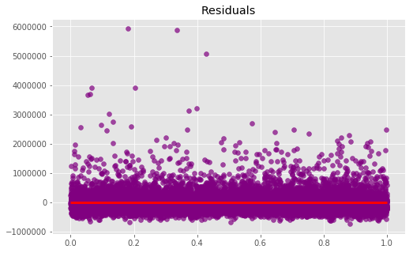


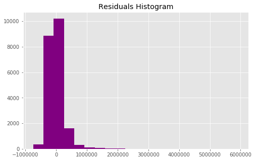


### Experiment #4 Observations
Condition Number continues to improve, skew and kurtosis do not. <br>
Next Step: Remove outlier residuals to improve overall performance of model.


```python
indices_to_drop = np.where(residuals > 1000000)[0]
```


```python
indices_to_drop
```


    array([   21,   246,   269,   282,   300,   312,   518,   656,   779,
             814,  1030,  1150,  1162,  1215,  1270,  1280,  1313,  1359,
            1431,  1446,  1674,  1768,  1943,  2038,  2083,  2138,  2265,
            2318,  2442,  2471,  2624,  2862,  2897,  2972,  3018,  3037,
            3089,  3278,  3381,  3515,  3731,  3744,  3809,  3857,  3867,
            3910,  4009,  4028,  4031,  4145,  4186,  4264,  4335,  4407,
            4631,  4758,  4855,  4917,  4918,  5444,  5584,  5612,  5697,
            5874,  5961,  6039,  6189,  6329,  6396,  6502,  6708,  6765,
            6777,  7028,  7184,  7245,  7304,  7306,  7425,  7499,  7645,
            7693,  7900,  7904,  7926,  7982,  8042,  8085,  8184,  8215,
            8629,  9166,  9245,  9313,  9478,  9599, 10252, 10362, 10435,
           10454, 11213, 11245, 11266, 11434, 11453, 11523, 11608, 11674,
           11940, 11963, 12174, 12358, 12447, 12601, 12636, 12638, 12700,
           12813, 12859, 13007, 13058, 13243, 13406, 13515, 13662, 13697,
           13774, 13954, 14017, 14039, 14070, 14126, 14172, 14241, 14372,
           14499, 14536, 14542, 14605, 14808, 15008, 15025, 15138, 15166,
           15190, 15232, 15241, 15244, 15363, 15401, 15468, 15498, 15618,
           15877, 16109, 16243, 16287, 16599, 16802, 16810, 16929, 16954,
           16986, 17136, 17273, 17313, 17543, 17752, 17884, 18184, 18191,
           18193, 18211, 18287, 18313, 18393, 18439, 18461, 18466, 18540,
           18752, 18777, 18860, 18866, 18896, 19001, 19132, 19220, 19467,
           19667, 19760, 19806, 19841, 19967, 19993, 20127, 20137, 20230,
           20278, 20308, 20309, 20424, 20443, 20518, 20647, 20750, 21023,
           21124, 21184, 21293, 21351, 21513, 21559], dtype=int64)


```python
df_trimmed = df.drop(index = indices_to_drop)
df_trimmed.iloc[20:25]
```


<div>
<style scoped>
    .dataframe tbody tr th:only-of-type {
        vertical-align: middle;
    }

    .dataframe tbody tr th {
        vertical-align: top;
    }

    .dataframe thead th {
        text-align: right;
    }
</style>
<table border="1" class="dataframe">
  <thead>
    <tr style="text-align: right;">
      <th></th>
      <th>date</th>
      <th>price</th>
      <th>bedrooms</th>
      <th>bathrooms</th>
      <th>sqft_living</th>
      <th>sqft_lot</th>
      <th>floors</th>
      <th>waterfront</th>
      <th>view</th>
      <th>condition</th>
      <th>...</th>
      <th>yr_built</th>
      <th>yr_renovated</th>
      <th>zipcode</th>
      <th>lat</th>
      <th>long</th>
      <th>sqft_living15</th>
      <th>sqft_lot15</th>
      <th>season</th>
      <th>total_rooms</th>
      <th>sqft_living_log</th>
    </tr>
  </thead>
  <tbody>
    <tr>
      <th>20</th>
      <td>2014-05-14</td>
      <td>385000.0</td>
      <td>4</td>
      <td>1.75</td>
      <td>1620</td>
      <td>4980</td>
      <td>1.0</td>
      <td>0.0</td>
      <td>0.0</td>
      <td>4</td>
      <td>...</td>
      <td>1947</td>
      <td>0.0</td>
      <td>98133</td>
      <td>47.7025</td>
      <td>-122.341</td>
      <td>1400</td>
      <td>4980</td>
      <td>1</td>
      <td>5.75</td>
      <td>7.390181</td>
    </tr>
    <tr>
      <th>22</th>
      <td>2014-07-03</td>
      <td>285000.0</td>
      <td>5</td>
      <td>2.50</td>
      <td>2270</td>
      <td>6300</td>
      <td>2.0</td>
      <td>0.0</td>
      <td>0.0</td>
      <td>3</td>
      <td>...</td>
      <td>1995</td>
      <td>0.0</td>
      <td>98092</td>
      <td>47.3266</td>
      <td>-122.169</td>
      <td>2240</td>
      <td>7005</td>
      <td>2</td>
      <td>7.50</td>
      <td>7.727535</td>
    </tr>
    <tr>
      <th>23</th>
      <td>2014-05-16</td>
      <td>252700.0</td>
      <td>2</td>
      <td>1.50</td>
      <td>1070</td>
      <td>9643</td>
      <td>1.0</td>
      <td>0.0</td>
      <td>0.0</td>
      <td>3</td>
      <td>...</td>
      <td>1985</td>
      <td>0.0</td>
      <td>98030</td>
      <td>47.3533</td>
      <td>-122.166</td>
      <td>1220</td>
      <td>8386</td>
      <td>1</td>
      <td>3.50</td>
      <td>6.975414</td>
    </tr>
    <tr>
      <th>24</th>
      <td>2014-11-20</td>
      <td>329000.0</td>
      <td>3</td>
      <td>2.25</td>
      <td>2450</td>
      <td>6500</td>
      <td>2.0</td>
      <td>0.0</td>
      <td>0.0</td>
      <td>4</td>
      <td>...</td>
      <td>1985</td>
      <td>0.0</td>
      <td>98030</td>
      <td>47.3739</td>
      <td>-122.172</td>
      <td>2200</td>
      <td>6865</td>
      <td>3</td>
      <td>5.25</td>
      <td>7.803843</td>
    </tr>
    <tr>
      <th>25</th>
      <td>2014-11-03</td>
      <td>233000.0</td>
      <td>3</td>
      <td>2.00</td>
      <td>1710</td>
      <td>4697</td>
      <td>1.5</td>
      <td>0.0</td>
      <td>0.0</td>
      <td>5</td>
      <td>...</td>
      <td>1941</td>
      <td>0.0</td>
      <td>98002</td>
      <td>47.3048</td>
      <td>-122.218</td>
      <td>1030</td>
      <td>4705</td>
      <td>3</td>
      <td>5.00</td>
      <td>7.444249</td>
    </tr>
  </tbody>
</table>
<p>5 rows × 23 columns</p>
</div>


```python
df_trimmed.reset_index(drop = True, inplace = True)
df_trimmed.iloc[20:25]
```


<div>
<style scoped>
    .dataframe tbody tr th:only-of-type {
        vertical-align: middle;
    }

    .dataframe tbody tr th {
        vertical-align: top;
    }

    .dataframe thead th {
        text-align: right;
    }
</style>
<table border="1" class="dataframe">
  <thead>
    <tr style="text-align: right;">
      <th></th>
      <th>date</th>
      <th>price</th>
      <th>bedrooms</th>
      <th>bathrooms</th>
      <th>sqft_living</th>
      <th>sqft_lot</th>
      <th>floors</th>
      <th>waterfront</th>
      <th>view</th>
      <th>condition</th>
      <th>...</th>
      <th>yr_built</th>
      <th>yr_renovated</th>
      <th>zipcode</th>
      <th>lat</th>
      <th>long</th>
      <th>sqft_living15</th>
      <th>sqft_lot15</th>
      <th>season</th>
      <th>total_rooms</th>
      <th>sqft_living_log</th>
    </tr>
  </thead>
  <tbody>
    <tr>
      <th>20</th>
      <td>2014-05-14</td>
      <td>385000.0</td>
      <td>4</td>
      <td>1.75</td>
      <td>1620</td>
      <td>4980</td>
      <td>1.0</td>
      <td>0.0</td>
      <td>0.0</td>
      <td>4</td>
      <td>...</td>
      <td>1947</td>
      <td>0.0</td>
      <td>98133</td>
      <td>47.7025</td>
      <td>-122.341</td>
      <td>1400</td>
      <td>4980</td>
      <td>1</td>
      <td>5.75</td>
      <td>7.390181</td>
    </tr>
    <tr>
      <th>21</th>
      <td>2014-07-03</td>
      <td>285000.0</td>
      <td>5</td>
      <td>2.50</td>
      <td>2270</td>
      <td>6300</td>
      <td>2.0</td>
      <td>0.0</td>
      <td>0.0</td>
      <td>3</td>
      <td>...</td>
      <td>1995</td>
      <td>0.0</td>
      <td>98092</td>
      <td>47.3266</td>
      <td>-122.169</td>
      <td>2240</td>
      <td>7005</td>
      <td>2</td>
      <td>7.50</td>
      <td>7.727535</td>
    </tr>
    <tr>
      <th>22</th>
      <td>2014-05-16</td>
      <td>252700.0</td>
      <td>2</td>
      <td>1.50</td>
      <td>1070</td>
      <td>9643</td>
      <td>1.0</td>
      <td>0.0</td>
      <td>0.0</td>
      <td>3</td>
      <td>...</td>
      <td>1985</td>
      <td>0.0</td>
      <td>98030</td>
      <td>47.3533</td>
      <td>-122.166</td>
      <td>1220</td>
      <td>8386</td>
      <td>1</td>
      <td>3.50</td>
      <td>6.975414</td>
    </tr>
    <tr>
      <th>23</th>
      <td>2014-11-20</td>
      <td>329000.0</td>
      <td>3</td>
      <td>2.25</td>
      <td>2450</td>
      <td>6500</td>
      <td>2.0</td>
      <td>0.0</td>
      <td>0.0</td>
      <td>4</td>
      <td>...</td>
      <td>1985</td>
      <td>0.0</td>
      <td>98030</td>
      <td>47.3739</td>
      <td>-122.172</td>
      <td>2200</td>
      <td>6865</td>
      <td>3</td>
      <td>5.25</td>
      <td>7.803843</td>
    </tr>
    <tr>
      <th>24</th>
      <td>2014-11-03</td>
      <td>233000.0</td>
      <td>3</td>
      <td>2.00</td>
      <td>1710</td>
      <td>4697</td>
      <td>1.5</td>
      <td>0.0</td>
      <td>0.0</td>
      <td>5</td>
      <td>...</td>
      <td>1941</td>
      <td>0.0</td>
      <td>98002</td>
      <td>47.3048</td>
      <td>-122.218</td>
      <td>1030</td>
      <td>4705</td>
      <td>3</td>
      <td>5.00</td>
      <td>7.444249</td>
    </tr>
  </tbody>
</table>
<p>5 rows × 23 columns</p>
</div>


```python
# Experiment #5
variable_features = ['sqft_living_log', 'floors', 'condition', 
                     'grade', 'season', 'total_rooms']
ols, res = make_ols_model(df = df_trimmed, columns_to_use = variable_features, add_constant = False)
```

                                OLS Regression Results                            
    ==============================================================================
    Dep. Variable:                  price   R-squared:                       0.860
    Model:                            OLS   Adj. R-squared:                  0.860
    Method:                 Least Squares   F-statistic:                 2.182e+04
    Date:                Fri, 27 Sep 2019   Prob (F-statistic):               0.00
    Time:                        12:03:24   Log-Likelihood:            -2.9415e+05
    No. Observations:               21383   AIC:                         5.883e+05
    Df Residuals:                   21377   BIC:                         5.884e+05
    Df Model:                           6                                         
    Covariance Type:            nonrobust                                         
    ===================================================================================
                          coef    std err          t      P>|t|      [0.025      0.975]
    -----------------------------------------------------------------------------------
    sqft_living_log -1.619e+05   2548.871    -63.511      0.000   -1.67e+05   -1.57e+05
    floors           -3.29e+04   3384.347     -9.721      0.000   -3.95e+04   -2.63e+04
    condition        3.469e+04   2471.148     14.039      0.000    2.98e+04    3.95e+04
    grade            1.832e+05   1968.882     93.063      0.000    1.79e+05    1.87e+05
    season          -6318.0039   1520.301     -4.156      0.000   -9297.908   -3338.100
    total_rooms      5.301e+04   1375.206     38.548      0.000    5.03e+04    5.57e+04
    ==============================================================================
    Omnibus:                     9950.444   Durbin-Watson:                   1.957
    Prob(Omnibus):                  0.000   Jarque-Bera (JB):           104154.007
    Skew:                           1.975   Prob(JB):                         0.00
    Kurtosis:                      13.065   Cond. No.                         29.5
    ==============================================================================
    
    Warnings:
    [1] Standard Errors assume that the covariance matrix of the errors is correctly specified.
    

### Experiment #5 Observations
R-Squared improved a bit, Condition Number didn't change, Skew and Kurtosis fell dramatically. Attempting one more run of residual outlier removal.


```python
residuals = res.resid
```


```python
make_residual_plots(residuals = residuals)
```


```python
indices_to_drop2 = np.where(residuals > 1000000)[0]
indices_to_drop2
```


    array([  152,  3189,  4428,  4751,  5795,  6160,  6922,  8346,  8810,
           10357, 11287, 11650, 13132, 14086, 14979, 15001, 15387, 15512,
           15661, 15723, 15954, 16082, 16087, 16130, 16441, 16643, 16650,
           16768, 16792, 16823, 16972, 17108, 17147, 17376, 17584, 17715,
           18014, 18020, 18021, 18038, 18113, 18138, 18217, 18262, 18283,
           18287, 18360, 18571, 18595, 18677, 18682, 18711, 18815, 18945,
           19032, 19119, 19147, 19278, 19323, 19477, 19551, 19569, 19614,
           19648, 19773, 19798, 19931, 19940, 20032, 20079, 20108, 20151,
           20222, 20240, 20314, 20442, 20544, 20816, 20916, 20975, 21083,
           21140, 21301, 21346], dtype=int64)


```python
df_trimmed2 = df_trimmed.drop(index = indices_to_drop2)
```


```python
df_trimmed2.iloc[149:153]
```


<div>
<style scoped>
    .dataframe tbody tr th:only-of-type {
        vertical-align: middle;
    }

    .dataframe tbody tr th {
        vertical-align: top;
    }

    .dataframe thead th {
        text-align: right;
    }
</style>
<table border="1" class="dataframe">
  <thead>
    <tr style="text-align: right;">
      <th></th>
      <th>date</th>
      <th>price</th>
      <th>bedrooms</th>
      <th>bathrooms</th>
      <th>sqft_living</th>
      <th>sqft_lot</th>
      <th>floors</th>
      <th>waterfront</th>
      <th>view</th>
      <th>condition</th>
      <th>...</th>
      <th>yr_built</th>
      <th>yr_renovated</th>
      <th>zipcode</th>
      <th>lat</th>
      <th>long</th>
      <th>sqft_living15</th>
      <th>sqft_lot15</th>
      <th>season</th>
      <th>total_rooms</th>
      <th>sqft_living_log</th>
    </tr>
  </thead>
  <tbody>
    <tr>
      <th>149</th>
      <td>2014-08-20</td>
      <td>532170.0</td>
      <td>3</td>
      <td>2.0</td>
      <td>1360</td>
      <td>3090</td>
      <td>2.0</td>
      <td>0.0</td>
      <td>0.0</td>
      <td>3</td>
      <td>...</td>
      <td>1990</td>
      <td>0.0</td>
      <td>98103</td>
      <td>47.6838</td>
      <td>-122.353</td>
      <td>1500</td>
      <td>3090</td>
      <td>2</td>
      <td>5.0</td>
      <td>7.215240</td>
    </tr>
    <tr>
      <th>150</th>
      <td>2015-04-09</td>
      <td>560000.0</td>
      <td>3</td>
      <td>1.0</td>
      <td>1110</td>
      <td>5000</td>
      <td>1.5</td>
      <td>0.0</td>
      <td>0.0</td>
      <td>3</td>
      <td>...</td>
      <td>1947</td>
      <td>0.0</td>
      <td>98107</td>
      <td>47.6550</td>
      <td>-122.359</td>
      <td>1420</td>
      <td>5000</td>
      <td>1</td>
      <td>4.0</td>
      <td>7.012115</td>
    </tr>
    <tr>
      <th>151</th>
      <td>2015-03-31</td>
      <td>282950.0</td>
      <td>3</td>
      <td>1.0</td>
      <td>1250</td>
      <td>8200</td>
      <td>1.0</td>
      <td>0.0</td>
      <td>0.0</td>
      <td>4</td>
      <td>...</td>
      <td>1954</td>
      <td>0.0</td>
      <td>98003</td>
      <td>47.3255</td>
      <td>-122.304</td>
      <td>1680</td>
      <td>8633</td>
      <td>1</td>
      <td>4.0</td>
      <td>7.130899</td>
    </tr>
    <tr>
      <th>153</th>
      <td>2014-05-16</td>
      <td>350000.0</td>
      <td>1</td>
      <td>1.0</td>
      <td>700</td>
      <td>5100</td>
      <td>1.0</td>
      <td>0.0</td>
      <td>0.0</td>
      <td>3</td>
      <td>...</td>
      <td>1942</td>
      <td>0.0</td>
      <td>98115</td>
      <td>47.6790</td>
      <td>-122.300</td>
      <td>1010</td>
      <td>5100</td>
      <td>1</td>
      <td>2.0</td>
      <td>6.551080</td>
    </tr>
  </tbody>
</table>
<p>4 rows × 23 columns</p>
</div>


```python
# Experiment #6
variable_features = ['sqft_living_log', 'condition', 
                     'grade', 'total_rooms']
ols, res = make_ols_model(df = df_trimmed2, columns_to_use = variable_features, add_constant = False)
```

                                OLS Regression Results                            
    ==============================================================================
    Dep. Variable:                  price   R-squared:                       0.874
    Model:                            OLS   Adj. R-squared:                  0.874
    Method:                 Least Squares   F-statistic:                 3.698e+04
    Date:                Fri, 27 Sep 2019   Prob (F-statistic):               0.00
    Time:                        12:03:40   Log-Likelihood:            -2.9116e+05
    No. Observations:               21299   AIC:                         5.823e+05
    Df Residuals:                   21295   BIC:                         5.824e+05
    Df Model:                           4                                         
    Covariance Type:            nonrobust                                         
    ===================================================================================
                          coef    std err          t      P>|t|      [0.025      0.975]
    -----------------------------------------------------------------------------------
    sqft_living_log -1.494e+05   2326.912    -64.224      0.000   -1.54e+05   -1.45e+05
    condition        3.799e+04   2217.701     17.132      0.000    3.36e+04    4.23e+04
    grade            1.651e+05   1759.244     93.823      0.000    1.62e+05    1.69e+05
    total_rooms      4.732e+04   1253.306     37.753      0.000    4.49e+04    4.98e+04
    ==============================================================================
    Omnibus:                     4937.243   Durbin-Watson:                   1.951
    Prob(Omnibus):                  0.000   Jarque-Bera (JB):            13008.112
    Skew:                           1.251   Prob(JB):                         0.00
    Kurtosis:                       5.898   Cond. No.                         27.8
    ==============================================================================
    
    Warnings:
    [1] Standard Errors assume that the covariance matrix of the errors is correctly specified.
    


```python
residuals = res.resid
make_residual_plots(residuals = residuals)
```


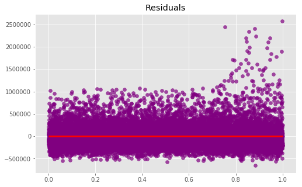


### Experiment #6 Observations
R-Squared, P-Values, Condition Number, Skew, and Kurtosis are all looking pretty great. Moving on to validation.

## Validation


```python
variable_features = ['sqft_living', 'grade', 
                     'total_rooms', 'condition']
X = df_trimmed2[variable_features]
y = df_trimmed2['price']

X_train, X_test, y_train, y_test = train_test_split(X, y, test_size = 0.25)

linreg = LinearRegression(fit_intercept = False)

linreg.fit(X_train, y_train)

print(linreg.score(X_test, y_test))
print(linreg.score(X_train, y_train))
print(linreg.score(X, y))

print(linreg.coef_)
```

    0.5275910608799861
    0.5082342912305322
    0.5132112267321329
    [   217.36965229  41439.07531927 -40730.90538456  -5007.36216663]
    


```python
cv = cross_val_score(linreg, X, y, cv=5, n_jobs=-1, scoring='r2', verbose=2)
```

    [Parallel(n_jobs=-1)]: Using backend LokyBackend with 4 concurrent workers.
    [Parallel(n_jobs=-1)]: Done   5 out of   5 | elapsed:    5.3s finished
    


```python
cv
```


    array([0.49328599, 0.49111106, 0.51490508, 0.52540201, 0.53171582])


```python
cv.mean()
```


    0.5112839912790249


```python
cv.std()
```


    0.016497064166688655


```python
variable_features = ['sqft_living', 'grade', 
                    'total_rooms', 'condition']
make_reg_graph(df = df_trimmed2, columns = variable_features, figsize = (15, 10))
```


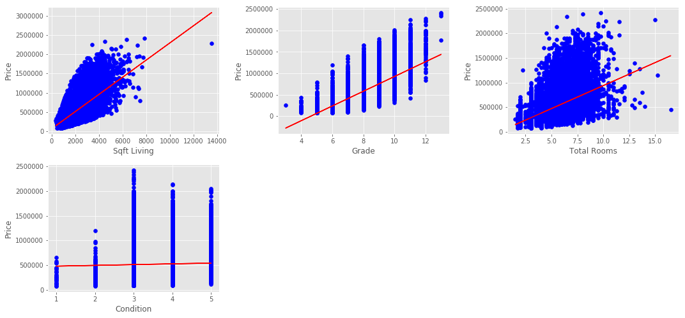


```python
# Removing outliers from sqft_living and grade
df_trimmed2 = df_trimmed2.loc[df_trimmed2['sqft_living'] < 12000]
df_trimmed2 = df_trimmed2.loc[df_trimmed2['grade'] >= 4]
df_trimmed2 = df_trimmed2.loc[df_trimmed2['grade'] <= 12]
```


```python
variable_features = ['sqft_living', 'grade', 
                    'total_rooms', 'condition']
make_reg_graph(df = df_trimmed2, columns = variable_features, figsize = (15, 10))
```


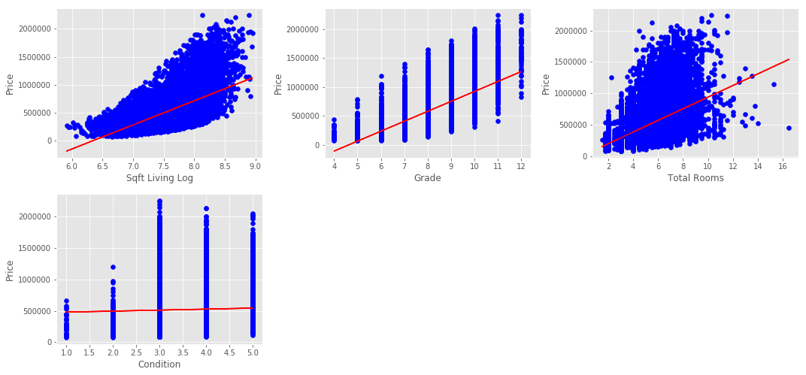


## Results & Summary

### Result Numbers
My final model ended with an R-Squared of 0.874, indicating that our best fit lines match the data very well for the most part. All P-Values are 0, along with the Probability of F-Statistic, which signals pretty high confidence that our chosen features are not random, and can linearly predict our target. Our Condition Number is pretty low, which in itself doesn't mean there's no multicolinearity, but would be an indicator of it were it higher. Our Skew and Kurtosis, while certainly not perfect, are fairly low which suggests some decent normality throughout our chosen features. Lastly, our Residuals are spread very evenly over their plot, which suggests good homoskedasticity. That means that our errors are consistent across variables, and do not depend on the X Values.

### Summary & Recommendations
I feel pretty comfortable with this particular model based on the numbers presented above, and in a situation where I'm recommending certain features to a Home Renovation Company to suggest to their customers, I would recommend increasing the house's square footage, total number of rooms (be they bathrooms or bedrooms), the home's grade, which would include improving the building materials and building quality, and the overall condition of the home, in terms of cleanliness and any potential spot-repairs that need to be done.

### Next Steps & Future Work
Were I to continue investigating the data, I would push towards verifying that the chosen features are not multicolinear which, as it stands they seem to not be based on the Condition Number, but as there are signs of multicolinearity based on the correlation values in the heatmaps.

In the future, I would want to gather more data on other features that could be changed via renovation, such as adding a pool or upgrading the bathroom and kitchen fixtures, to see what effect that could have on the overall price.


```python

```
